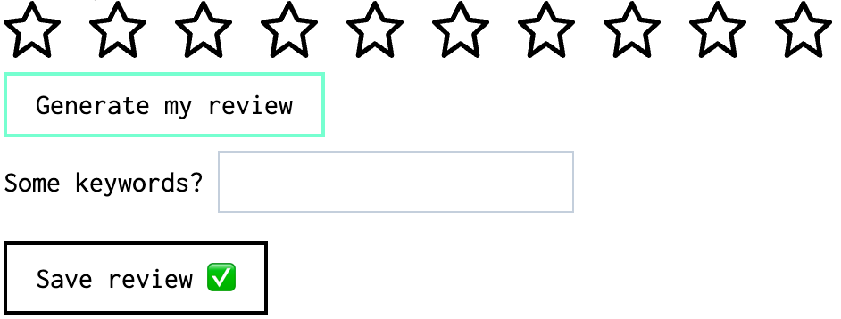
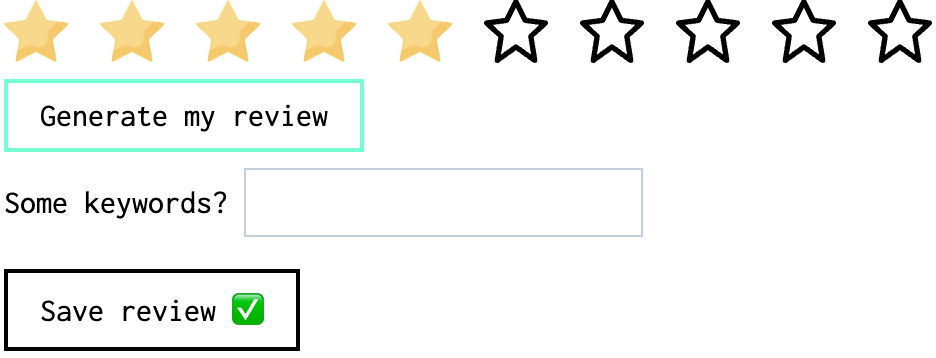

# **review-generator** web component

This is a web component that you can use in your `html` page and / or in any framework application you have built.

It will add the following UI elements:

- `rating` items
- `generate review` button.
- `keywords` text input (optional).
- `save review` button, when clicked, it will trigger an `onreviewsent` custom event.

Examples:



To generate a review:

1. Pick a score
2. Click `Generate my review`.
3. You can generate as many reviews as you want.
4. Optionally write down some keywords, comma separated, like this `battery, screen`.
5. When you are happy with the results, click `Save review` button to inform the website that you want to submit the `score` and the `review`.

## Live demo

[Stackblitz interactive](https://stackblitz.com/edit/review-generator)

## Usage

1. Add the web component script

   ```html
   <script
     type="module"
     src="https://review-generator.pages.dev/review-generator-v0.0.1.js"
   ></script>
   ```

2. Call the component where you like in your site/app.

   ```html
   <review-generator
     item-category="blog post"
     item-name="Client-side Routing without the JavaScript"
     max-score="5"
     score-item="☑️"
     score-item-selected="✅"
   ></review-generator>
   ```

## Component API

- `item-category`: Type of the product the user is gonna review, like `blog post`, `laptop`, `project`, `food`, etc.
- `item-name`: Based on the `item-category`, what is the specific item the user is gonna review, like `how to get started with Astro`, `macbook air`, `pizza calzone`, etc.
- `max-score`: The maximum score the item can have.
- `score-item`: What will be displayed in the UI as the not filled icon for the score.
- `score-item-selected`: What will be displayed in the UI as the filled icon for the score.
- `children`: There is 3 kinds of `<template>` supported as a children:

  - `name="styles"`: Scoped custom styles inside the web component.

    ```html
    <template name="styles">
      <style>
        span > svg {
          width: 2rem;
          height: 2rem;
        }
        .fetch-button {
          border-color: aquamarine;
        }
      </style>
    </template>
    ```

  - `name="scoreitem"`: The content will be used as the not filled icon for the score.

    ```html
    <template name="scoreitem">
      <span
        ><svg
          fill="#000000"
          height="800px"
          width="800px"
          version="1.1"
          id="Layer_1"
          xmlns="http://www.w3.org/2000/svg"
          xmlns:xlink="http://www.w3.org/1999/xlink"
          viewBox="0 0 512.062 512.062"
          xml:space="preserve"
        >
          <g>
            <g>
              <path
                d="M493.516,170.854l-148.833-19.839L275.114,11.797c-7.86-15.729-30.306-15.729-38.167,0l-69.569,139.217L18.545,170.854
             c-17.92,2.389-24.932,24.589-11.635,36.837l107.39,98.922L85.628,487.324c-2.966,18.692,18.069,31.703,33.469,20.703
             l136.934-97.81l136.934,97.81c15.401,11,36.435-2.011,33.47-20.703l-28.673-180.711l107.39-98.922
             C518.448,195.442,511.437,173.242,493.516,170.854z M360.447,282.976c-5.252,4.838-7.735,11.982-6.616,19.034l22.481,141.688
             L268.431,366.64c-7.418-5.298-17.382-5.298-24.799,0L135.75,443.698l22.481-141.688c1.119-7.052-1.364-14.196-6.616-19.034
             l-82.333-75.841l114.944-15.322c7.011-0.935,13.103-5.283,16.265-11.61l55.541-111.145l55.541,111.145
             c3.162,6.327,9.254,10.676,16.265,11.61l114.944,15.322L360.447,282.976z"
              />
            </g>
          </g></svg
      ></span>
    </template>
    ```

  - `name="scoreitemselected"`: The content will be used as the filled icon for the score.

    ```html
    <template name="scoreitemselected">
      <span
        ><svg
          height="800px"
          width="800px"
          version="1.1"
          id="Layer_1"
          xmlns="http://www.w3.org/2000/svg"
          xmlns:xlink="http://www.w3.org/1999/xlink"
          viewBox="0 0 511.999 511.999"
          xml:space="preserve"
        >
          <path
            style="fill: #f9de8f"
            d="M265.538,17.937l70.867,143.593c1.549,3.139,4.545,5.316,8.01,5.82l158.464,23.026
         c8.725,1.268,12.209,11.99,5.896,18.145L394.109,320.293c-2.508,2.443-3.651,5.964-3.059,9.416l27.068,157.824
         c1.49,8.69-7.631,15.317-15.435,11.214l-141.735-74.515c-3.098-1.63-6.801-1.63-9.9,0l-141.735,74.513
         c-7.804,4.103-16.925-2.524-15.435-11.214l27.068-157.824c0.592-3.451-0.552-6.972-3.059-9.416L3.224,208.52
         c-6.313-6.155-2.829-16.877,5.896-18.145l158.464-23.026c3.465-0.503,6.459-2.68,8.01-5.82l70.867-143.593
         C250.362,10.03,261.636,10.03,265.538,17.937z"
          />
          <path
            style="fill: #f7cf6d"
            d="M508.775,208.52c6.313-6.155,2.829-16.877-5.896-18.145l-74.471-10.821l-57.167,55.724
         c-17.296,16.86-25.188,41.15-21.105,64.955l0,0c10.283,59.948-52.641,105.665-106.478,77.36l0,0c-21.379-11.24-46.92-11.24-68.299,0
         l-68.831,36.186l-12.65,73.75c-1.49,8.69,7.631,15.317,15.435,11.214l141.735-74.515c3.098-1.63,6.801-1.63,9.9,0l141.735,74.515
         c7.804,4.103,16.925-2.524,15.435-11.214l-27.068-157.824c-0.592-3.451,0.552-6.972,3.059-9.416L508.775,208.52z"
          /></svg
      ></span>
    </template>
    ```
